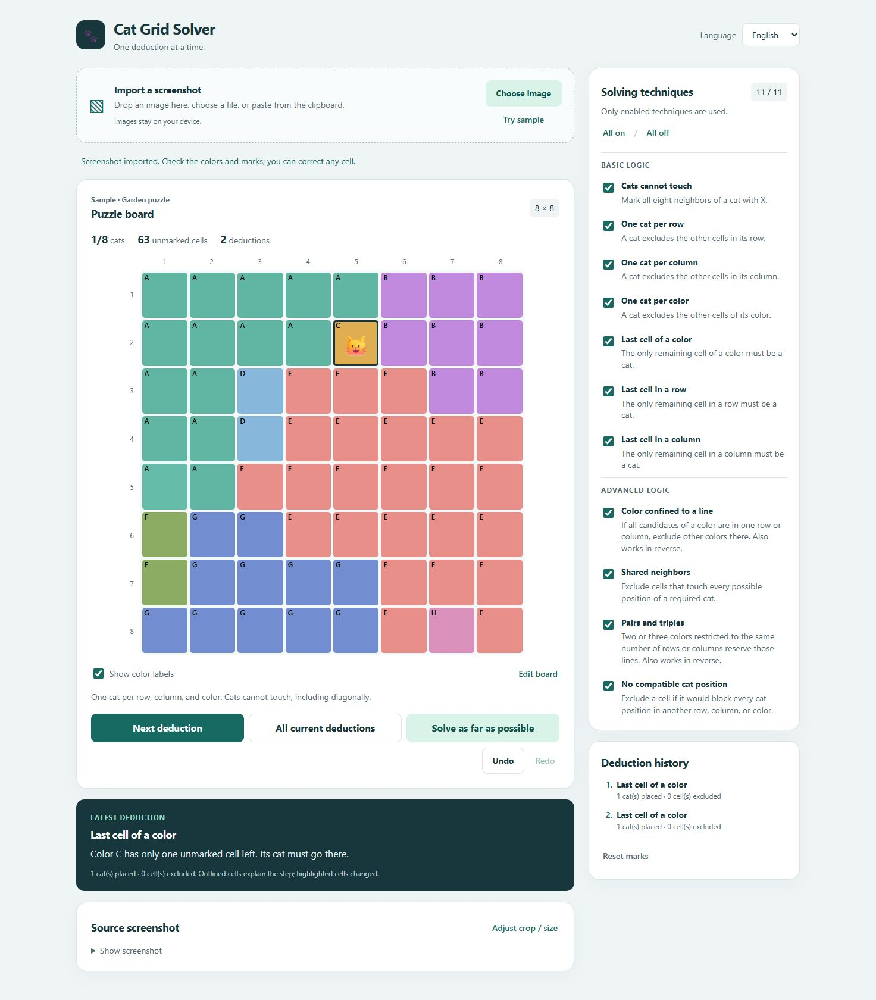

# Cat Grid Solver

A local browser app that imports colored cat grid puzzle screenshots and explains logical solving steps. It includes English and German, editable color regions and marks, and eleven individually selectable techniques. No runtime packages, accounts, or image services are required.

An independent project with an original demo puzzle and generated test images. It is not affiliated with any puzzle app publisher.



## Start

Requires Node.js 20 or newer. From this directory, run:

```powershell
npm start
```

Open http://127.0.0.1:5173 in your browser. To use another port:

```powershell
$env:PORT = '5174'
npm start
```

## Use

1. Choose, drop, or paste a PNG, JPEG, or WebP screenshot. **Try sample** imports the original Garden puzzle image through the same recognition pipeline.
2. Review the detected board. If needed, use **Adjust crop / size** to drag a rectangle around the entire colored grid and select its size. Square grids from 2×2 to 20×20 are supported; puzzles must have a valid solution under the rules below.
3. Click a cell to cycle between cat, X, and empty. **Edit board** provides explicit mark tools and a color brush. Choose a swatch to correct a region; **Add color** creates a missing color. Amber outlines flag uncertain recognition. Correct those cells before solving.
4. Enable the techniques you want to use, then choose one of the three solve actions:

| Action | Behavior |
| --- | --- |
| **Next deduction** | Apply one logical deduction, which may change one or several cells. |
| **All current deductions** | Find all deductions using the board exactly as it is now, then apply them together. New consequences wait until another click. |
| **Solve as far as possible** | Chain enabled logical deductions until solved or no further deduction is available. |

Every batch is one undoable action. **Undo** and **Redo** restore both board marks and color edits. **Reset marks** removes cats and X marks while preserving colors and is also undoable. Outlined cells are the evidence for the latest step; solid outlines identify changed cells. The history records the techniques used.

The language selector is always available. Language and technique preferences are remembered on this device. Puzzle work stays in the current tab and is reset on reload. Screenshot pixels are processed on your computer and are never uploaded. The app makes no external network requests.

Arrow keys move between cells. Space cycles a mark, C places a cat, X excludes a cell, and Delete clears it. Ctrl+Z / Cmd+Z undoes a change; add Shift to redo.

## Rules and techniques

There must be exactly one cat in every row, column, and color. Cats cannot touch, including diagonally. The solver uses logical constraints and never backtracks or guesses. An ambiguous puzzle may remain partially solved.

Basic techniques exclude neighbors or other cells in a cat's row, column, or color, and place a cat when a unit has one remaining cell. Advanced techniques use confined colors, common neighbors, pairs/triples, and incompatible candidate positions. Each technique can be disabled independently; disabled techniques never make changes implicitly.

The recognizer finds a regular colored grid, groups tile colors, and distinguishes cat shapes from X strokes. It is tuned for clear app screenshots. Cropped cells, animations, unusual marks, and very similar colors may need manual correction. Recognition uncertainty and rule conflicts are shown on the board.

## Verify

```powershell
npm test
npm run check
```

Tests cover the generated demo screenshot, original geometric cat and X marks, grid sizes, crop recovery, uncertain marks, the distinction between snapshot and chained batches, and every technique against an independent exhaustive solution oracle. Screenshot fixtures are compressed RGBA data, so the tests need only Node. `node scripts/create-fixtures.mjs` regenerates the demo PNG and fixtures without dependencies.

The browser app is in `dist/`; `server.mjs` serves it locally. Optional WebMCP tools use the same board actions as the visible buttons when the browser supports them.
